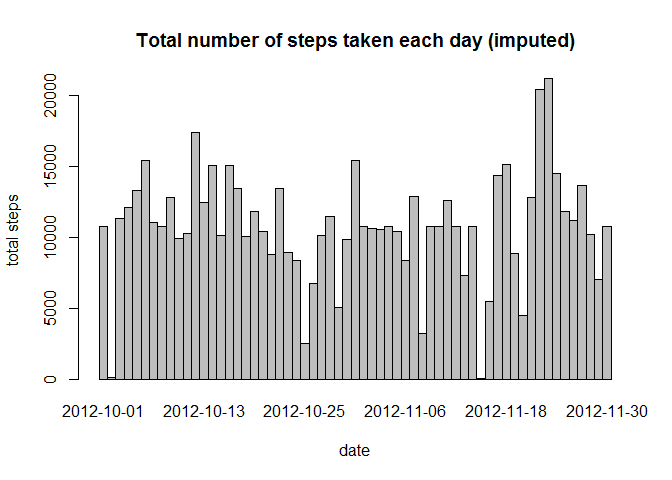

# Reproducible Research: Peer Assessment 1


## Loading and preprocessing the data


```r
if(!file.exists("activity.csv")){
    unzip("activity.zip")
}
rawData <- read.csv("activity.csv")
ActivityData <- rawData[complete.cases(rawData),]
```


## What is mean total number of steps taken per day?
let's firstly take a look at the chart.

```r
library(dplyr)
```

```
## 
## Attaching package: 'dplyr'
```

```
## The following objects are masked from 'package:stats':
## 
##     filter, lag
```

```
## The following objects are masked from 'package:base':
## 
##     intersect, setdiff, setequal, union
```

```r
library(ggplot2)

result <- aggregate(ActivityData$steps, by = list(ActivityData$date), FUN=sum)
colnames(result)<- c("date","steps")
barplot(result$steps, xlab="date", ylab="total steps", space=0, names.arg = result$date, main = "Total number of steps taken each day")
```

<!-- -->

let's take a look at the mean and median of the total number of steps taken per day. 

```r
summary(result)
```

```
##          date        steps      
##  2012-10-02: 1   Min.   :   41  
##  2012-10-03: 1   1st Qu.: 8841  
##  2012-10-04: 1   Median :10765  
##  2012-10-05: 1   Mean   :10766  
##  2012-10-06: 1   3rd Qu.:13294  
##  2012-10-07: 1   Max.   :21194  
##  (Other)   :47
```

## What is the average daily activity pattern?

```r
result2 <- aggregate(ActivityData$steps, by = list(ActivityData$interval), FUN=mean)
colnames(result2)<- c("interval","steps")
plot(result2$interval, result2$steps, xlab="time interval", ylab="average steps", type='l', main="Average daily activity pattern")
```

<!-- -->


## Imputing missing values
Note that there are a number of days/intervals where there are missing values (coded as NA). The presence of missing days may introduce bias into some calculations or summaries of the data.

1. Calculate and report the total number of missing values in the dataset (i.e. the total number of rows with NAs)


```r
summary(rawData)
```

```
##      steps                date          interval     
##  Min.   :  0.00   2012-10-01:  288   Min.   :   0.0  
##  1st Qu.:  0.00   2012-10-02:  288   1st Qu.: 588.8  
##  Median :  0.00   2012-10-03:  288   Median :1177.5  
##  Mean   : 37.38   2012-10-04:  288   Mean   :1177.5  
##  3rd Qu.: 12.00   2012-10-05:  288   3rd Qu.:1766.2  
##  Max.   :806.00   2012-10-06:  288   Max.   :2355.0  
##  NA's   :2304     (Other)   :15840
```

```r
cat("\n as described above, total NA's in raw data is:", nrow(rawData[!complete.cases(rawData),]), "\n")
```

```
## 
##  as described above, total NA's in raw data is: 2304
```

2. Devise a strategy for filling in all of the missing values in the dataset. Here we used the most simple strategy by filling the mean.

```r
rawData$steps.filled <- ifelse(is.na(rawData$steps),mean(rawData$steps, na.rm = TRUE),rawData$steps)
summary(rawData)
```

```
##      steps                date          interval       steps.filled   
##  Min.   :  0.00   2012-10-01:  288   Min.   :   0.0   Min.   :  0.00  
##  1st Qu.:  0.00   2012-10-02:  288   1st Qu.: 588.8   1st Qu.:  0.00  
##  Median :  0.00   2012-10-03:  288   Median :1177.5   Median :  0.00  
##  Mean   : 37.38   2012-10-04:  288   Mean   :1177.5   Mean   : 37.38  
##  3rd Qu.: 12.00   2012-10-05:  288   3rd Qu.:1766.2   3rd Qu.: 37.38  
##  Max.   :806.00   2012-10-06:  288   Max.   :2355.0   Max.   :806.00  
##  NA's   :2304     (Other)   :15840
```


## Are there differences in activity patterns between weekdays and weekends?

```r
#chaning the time display else it would be Chinese charactor on my end.
Sys.setlocale(category = "LC_ALL", locale = "english")
```

```
## [1] "LC_COLLATE=English_United States.1252;LC_CTYPE=English_United States.1252;LC_MONETARY=English_United States.1252;LC_NUMERIC=C;LC_TIME=English_United States.1252"
```

```r
rawData$day <- weekdays(as.Date(rawData$date), abbreviate = TRUE)
#rawData$week <- lubridate::week(as.Date(rawData$date))
rawData$isWeekday <- ifelse(rawData$day == "Sat" | rawData$day == "Sun", "weekday", "weekend")
result3 <- aggregate(rawData$steps, by = list(rawData$interval,rawData$isWeekday), FUN=mean, na.rm=TRUE)
colnames(result3)<- c("interval","isWeekday","steps.filled")

ggplot(data=result3, aes(x=interval, y=steps.filled, group=isWeekday, colour=isWeekday))+
       ggtitle("Ativity pattern (average step per 5 interval) color by weekdays / weekends") +
    geom_line() +
    geom_point()
```

<!-- -->
